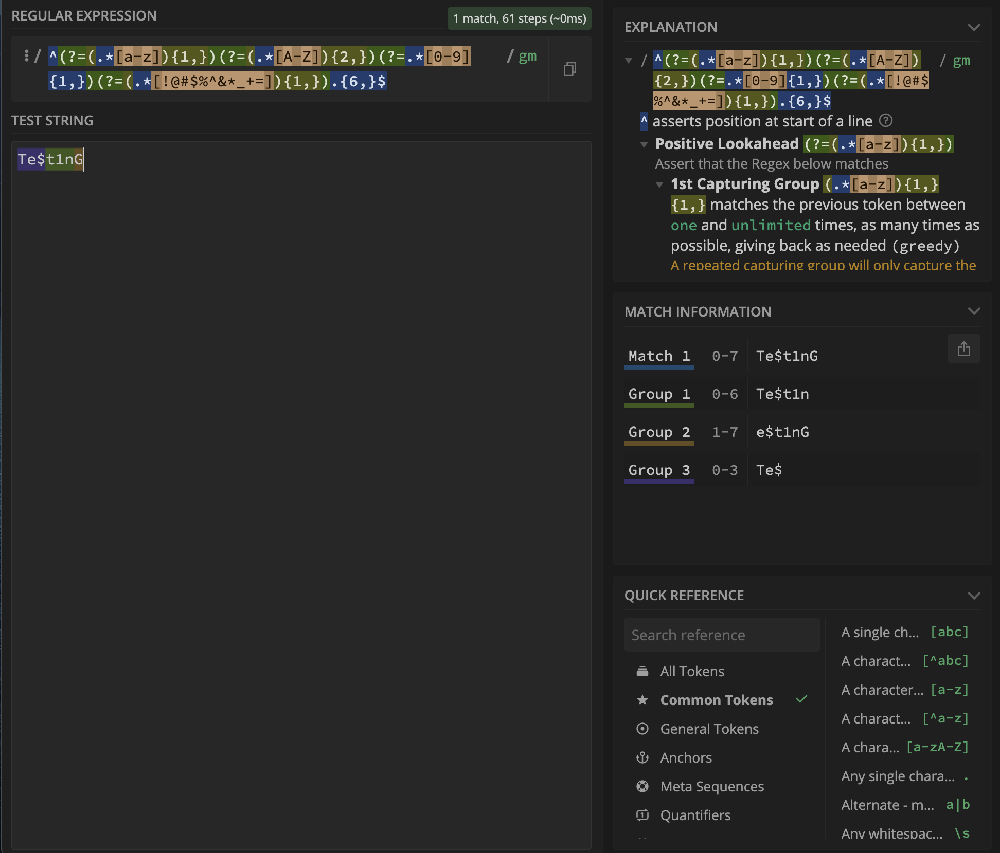

# Regex Tutorials

Regular Expressions consist of a (cryptic) sequence of characters that define search patterns in a body of text.

## Introduction

"Take this sentence for example."

The example word “Take” is a valid regular expression (regex) because it consists of a pattern of LITERAL characters: The word “Take” can be described as “Capital T”, followed by “lowercase a”, followed by “lowercase k”, followed by “lowercase e.” 
This example can also be used in terms of META characters which are more generalized search patterns. Here we could search for a pattern consisting of “Capital T”, followed by any vowel, consonant, digit, etc.

## Summary

For this tutorial, we will be covering a regex for a simple password with the following criteria:
- Minimum of 1 Lowercase Characters
- Minimum of 1 Uppercase Characters
- Minimum of 1 Numerals
- Minimum of 1 Special Character
- Password must be 6 or more Characters

`/^(?=(.*[a-z]){1,})(?=(.*[A-Z]){2,})(?=.*[0-9]{1,})(?=(.*[!@#$%^&*_+=]){1,}).{6,}$/`

## Table of Contents

- [Anchors](#anchors)
- [Quantifiers](#quantifiers)
- [Grouping Constructs](#grouping-constructs)
- [Bracket Expressions](#bracket-expressions)
- [Character Classes](#character-classes)
- [The OR Operator](#the-or-operator)
- [Author](#author)
- [Tests](#tests)

## Regex Components

### Anchors

The anchors in this example regex are the characters ^ and $.

The ^ anchor signifies the start of the string and the $ anchor signifies the end of the string.

### Quantifiers

To set and validate the minimum number of lowercase, uppercase and numerals required for the password, quantifiers are used. Quantifiers are greedy, meaning that they can match multiple occurrences within a given pattern.

- In our example, the quantifier {6,} followed by $ character at the end of of the regex states that the regex must be at least 6 characters in length to be valid. Since we have multiple quantifiers to fulfill for the password criteria, we can set the minimum to {1,} for all as required after the bracket expressions.

### Grouping Constructs

In order to segment requirements grouping constructs are used in regex with parentheses. Sections are labeled as subexpressions.

- In our example, the grouping constructs are used to fulfill the different requirements for the password criteria. The grouping construct captures that all lowercase, uppercase, numerals and special characters are accounted for at least once.

### Bracket Expressions

The bracket expressions are anything within the square brackets representing a specific set of characters (letters, numbers, etc.).

- In our example, the first bracket expression is the [a-z] with the hyphen (-) representing that it can be any lowercase letter in the alphabet from a to z. Other examples of our requirements include [A-Z] for Uppercase Characters and [0-9] for Numerals.

### Character Classes

Character class define sets of characters.

- In our example, the "." matches any character within each grouping construct. Another example can be seen with equivalent classes such as \d that matches numerals such as 0 to 9 in Javascript.

### The OR Operator

The OR Operator can be used to allow a wider range of characters to be represented within the bracket expression such as alphanumeric characters. This can be represented as [a-z0-9] which would search for any lowercase letter OR number. This could be used in this example if we wanted to limit any of the 4 requirements.

## Author

This was written by Carlos Barrientos for the Rice Coding Bootcamp.
- [Link to my GitHub Repository](https://github.com/WitnessMyHands)

## Tests

- [Link to Test Site](https://regex101.com/)
